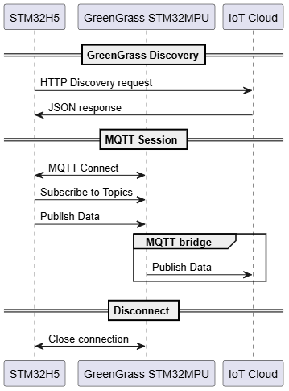
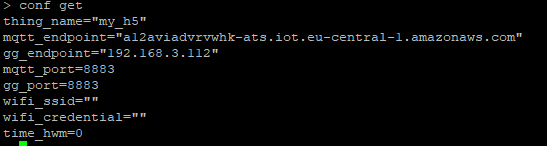
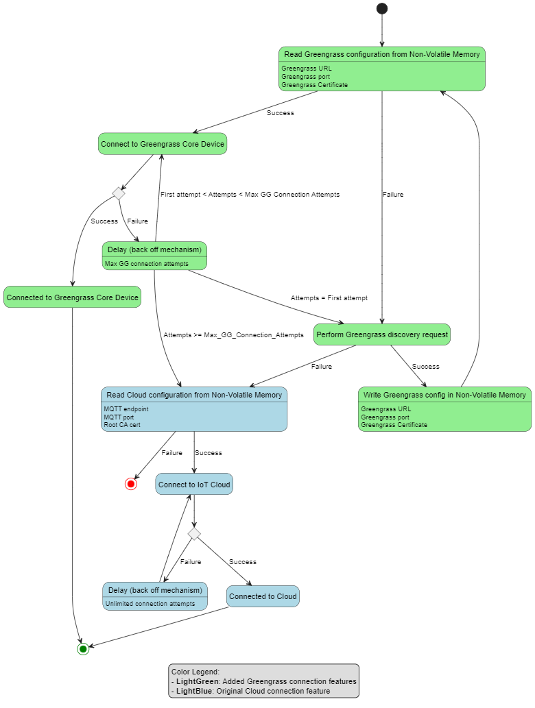
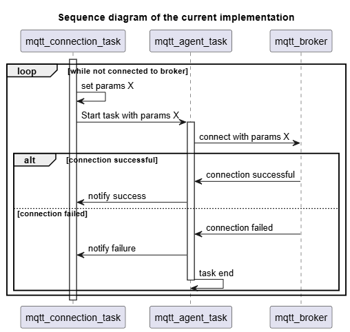
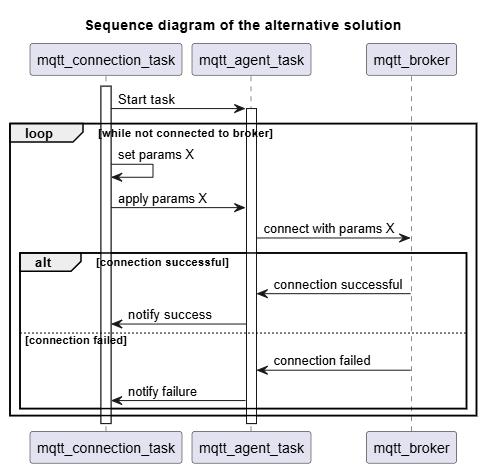

# Greengrass Discovery

## Overview

The Greengrass Discovery feature is designed to implement the discovery and establish a connection to a Greengrass core device. It implements the necessary functionalities: 
- sending HTTP discovery request
- parsing JSON response
- storing parsed values in Non-Volatile Memory (NVM)
- establishing a connection to the Greengrass core device using the stored configuration.

## Project File Structure

Below is the file structure of the added files related to the AWS Greengrass discovery feature:   

Common/                                    
├── app
│   ├── greengrass
│   │   ├── greengrass_discovery_task.c            
│   │   ├── greengrass_discovery_task.h
│   │   ├── x509_crt_ip_addr_san_verif.patch
│   ├── mqtt
│   │   ├── mqtt_connection_task.c
│   │   ├── mqtt_connection_task.h

## Global Sequence Diagram
The global sequence diagram below illustrates the overall process:

## Certificate Generation and Import Process

To successfully establish a secure connection with AWS Greengrass, it is essential to generate a Certificate Signing Request (CSR) using the `pki generate csr <label>` command, have it signed by AWS, and import the resulting certificate into the H5 device. Using a self-signed certificate will result in a `close_notify` error during the TLS connection.

## mbedTLS Middleware Modifications

To avoid the bad_certificate error while connecting to the Greengrass core device, a patch was made to the mbedTLS middleware, specifically in the `x509_crt.c` file. The existing mbedTLS middleware (version 3.1.1) lacked support for verifying IP addresses in the SAN field of x509 certificates. These changes enable custom Subject Alternative Name (SAN) verification for IP addresses, providing a solution that accommodates the current version of the middleware and avoids conflicts with newer API changes.
This modification ensures that IP addresses are correctly validated, thereby preventing `bad_certificate` errors during the TLS handshake with Greengrass core devices.
- A macro `MBEDTLS_CUSTOM_SAN_IP_VERIF` was added to the mbedTLS configuration file to activate the custom SAN verification feature.  
The current implementation is inspired by mbedTLS v3.5.0

## mbedTLS configuration file
Modifications were made to the `mbedtls_config_ntz.h` configuration file to enable RSA cipher suites. This change was crucial to prevent the `no cipher suites in common` error during the TLS handshake with the Greengrass core device. The modified parts are marked with the comment "Enable for greengrass" to make it easier to enable them.

The RSA cipher suites are necessary for both the Discovery and the connection to the Greengrass core device.

Additionally, it is essential to use the `Amazon Root CA 1` certificate, which provides 2048-bit RSA security. This certificate should be imported into the `root_ca_cert` to ensure connection with the cipher suite used.

## Features

### Discovery Request

- **HTTP Discovery Request:** Utilizes the HTTP client `coreHTTP` library to send HTTP discovery requests.
  - **Submodule Integration:** The `llhttp` is a necessary dependency that was added as a submodule to the project. To initialize and fetch the submodule after cloning the repository, use the following command: `git submodule update --init`.
  - **Endpoint Construction:** Constructs the discovery URL from the existing AWS endpoint stored in NVM. For example:
    - AWS endpoint: `**********-ats.iot.region.amazonaws.com`
    - Constructed Discovery endpoint: `greengrass-ats.iot.region.amazonaws.com`
  - This approach eliminates the need to store another endpoint for the Greengrass discovery feature, as only the region is required for the discovery URL.

- **TLS Connection Establishment:** 
  - Establishes a secure TLS connection to `greengrass-ats.iot.region.amazonaws.com` on port `8443`.
  - Sends the HTTP discovery request to `https://greengrass-ats.iot.region.amazonaws.com:8443/greengrass/discover/thing/thing-name` once the connection is established.

- **Response Handling:** The `transportRecv` function is designed to receive responses from the Greengrass server. It implements a loop with a timeout, using the `mbedtls_transport_recv` function. This approach prevents the `No response received` error caused by the delay in the Greengrass server's response time.

**Multiple Core Devices Limitation:**

The current implementation does not support handling multiple Greengrass core devices or multiple CA certificates returned in the discovery response. The lack of support comes from the design of the discovery response processing logic, which only precesses the first core device and the first CA certificate.

### JSON Parsing and NVM Storage

The parsing of the JSON response is done by using the CoreJSON library which is already integrated into the project.
- **JSON Response Parsing:** The function `parseGGDiscoveryResponse` parses the JSON response received from the Greengrass core device, it returns pointers for the parsed endpoint, port, and CA.
- **Certificate Formatting:** The parsed certificate requires formatting to replace escaped newline sequences (`\\n`) with actual newline characters (`\n`).
- **NVM Storage:** Writes the parsed configuration values into Non-Volatile Memory (NVM) and commits changes for persistent storage and future use, The following labels and files are defined for storage:
  - **Greengrass CA:** Stored in the file `corePKCS11_GG_CA_Certificate.dat` under the label `root_gg_ca_cert`.
  - **Greengrass Endpoint:** Stored under the label `gg_endpoint`, it can be either an IP address or a common name (CN).
  - **Port:** Stored under the label `gg_port`.

### Connection to Greengrass Core

The connection is detailed in the state machine below:

- **Connection Process:** The `vMQTTAgentTask` is responsible for establishing a connection to the Greengrass core device. Initially, it attempts to connect using the existing Greengrass configuration stored in Non-Volatile Memory (NVM). If this attempt fails, the task performs a Greengrass Discovery to retrieve the necessary configuration, updates the NVM, and retry the connection. If all attempts are exhausted without success, the system connects to the AWS cloud.

- After successfully establishing a connection with the Greengrass core device, the system proceeds with its default operations. This includes subscribing to relevant topics, calling additional tasks, and publishing data to the given MQTT topic.

#### **Modification in MQTT Agent Task**

A modification was made to the `vMQTTAgentTask` to delay the initialization of the `mqttAgentHandler` pointer until the MQTT agent is successfully connected. This change was necessary because other tasks rely on the `mqttAgentHandler` pointer once it is initialized. In scenarios where the MQTT agent task fails to connect and restarts, the pointer remains initialized in those dependent tasks which causes assertion faults.

By delaying the initialization of the `mqttAgentHandler` pointer until the MQTT agent is connected, this issue is avoided. 

**Alternative Solutions:**
- Another possible solution would be to terminate the tasks that are using the `mqttAgentHandler` pointer if the MQTT agent task fails and restart them when the MQTT agent task is retried. However, the current approach of delaying the pointer initialization is simpler, and involves fewer modifications to other tasks, and avoids unnecessary task management.
- An improved approach consists in starting the `vMQTTAgentTask` only once with a pointer to the agent handler. If the connection attempt fails, instead of restarting the entire task with different parameters, the connection parameters are updated dynamically and the connection retried within the same task instance. 

 

